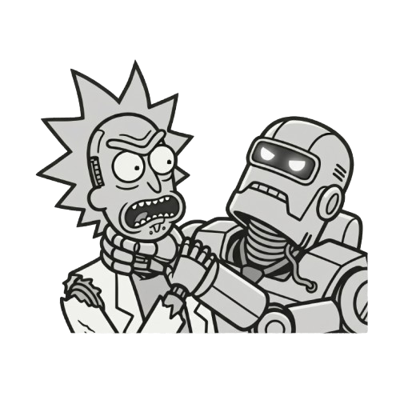

<h1 align="left">
  
  <span style="vertical-align:middle;">RoboWrecker</span>
</h1>

RoboWrecker is an automation tool for testing AI chatbots in a simple and practical way. It works by using one AI agent to automatically talk to another (the target chatbot) and send different inputs based on the objectives and the target's agent responses.

The tool helps guide how these interactions happen, making it easier to simulate real-world scenarios and check how the target AI responds. This allows users to identify weaknesses, understand behavior, and evaluate how secure and reliable the chatbot is.

<p align="center">
  
  <br>
  <strong>It takes a bot to break a bot</strong>
</p>


<p align="center">

<a href="https://eslam3kl.gitbook.io/blog/recon-automation-and-more/robowrecker-ai-tool"></a>
&nbsp;&nbsp;


## Features

- Adaptive red-team loop driven by an advisor model  
- HTTP and WebSocket target support  
- Per-agent connection testing from the UI (attacker + target)  
- Live assessment monitoring (running and completed views)  
- Operator instruction injection during active runs  
- Conversation-aware attack iteration and objective tracking  
- Leak counting and status reporting in dashboard tables  
- Theme-aware UI with role-based conversation styling  

## How It Works

1. Configure attacker and target agents through the dashboard.  
2. Launch an assessment with a defined objective and context.
3. The attacker advisor generates payloads based on target responses.  
4. Payloads are sent to the target via HTTP or WebSocket transport.  
5. Responses are evaluated, logged, and displayed in real time.  
6. Operator instructions can be injected to steer execution mid-run.  
7. Execution stops on objective completion, manual termination, or iteration limits  


Full installation guide, configuration details, and advanced usage are available here:

👉 https://eslam3kl.gitbook.io

## Project Structure
```
├── RoboWrecker.py        # Main entrypoint and assessment orchestration engine
├── dashboard.py          # Web dashboard server and UI logic (multi-agent + conversations)
├── advisor_agent.py      # Advisor model integration, payload generation, and evaluation
├── ws_transport.py       # WebSocket communication and transport handling
├── memory.py             # Logging, history tracking, and session memory management
├── req.http              # Sample HTTP requests for testing targets
├── ws_config.json        # WebSocket target configuration
├── logs.jsonl            # Runtime logs and assessment traces
├── requirements.txt      # Python dependencies
├── uv.lock               # Dependency lock file for reproducible environments
├── .gitignore            # Git ignore rules
└── images/               # UI assets and screenshots

```

## Security Notice
Use only in authorized environments where you have explicit permission to test.


